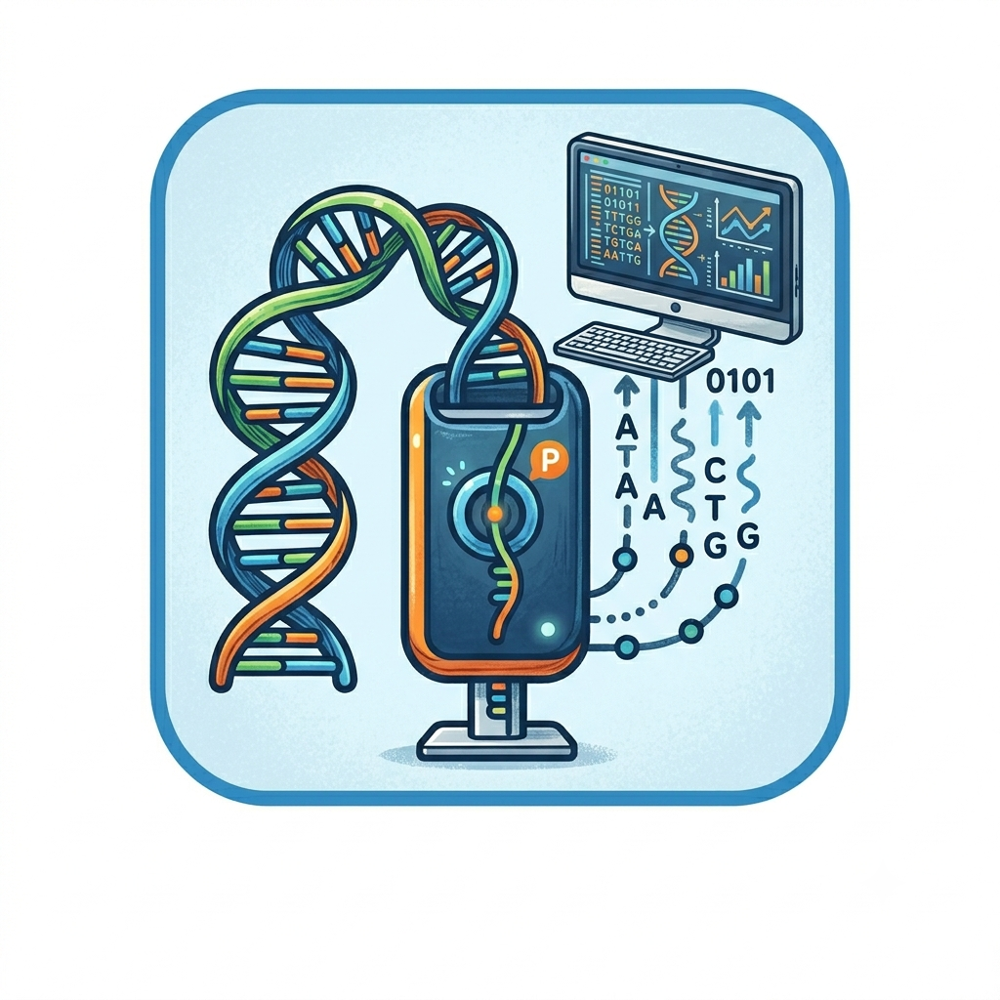

# Nanopore_Sequencing_Lab

This repository contains the google colab notebooks and the .yaml file for building conda environments for the practical hands-on laboratory of DIFA summer school "Physics for a better planet".
